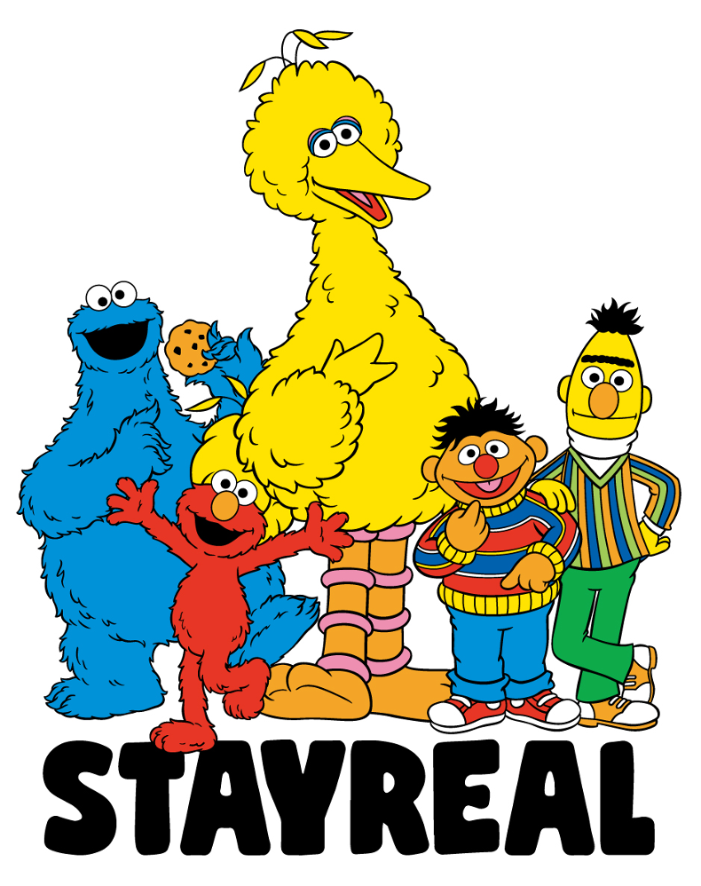

# DistilBert 

## 1. Background

### 1.1. BERT model

BERT (Bidirectional Encoder Representations from Transformers) 

#### 1.1.1. train task

* Only predict the masked words rather than reconstructing the entire input 
* Masked Language Model (MLM)  and next sentence prediction 

#### 1.1.2. Architecture

