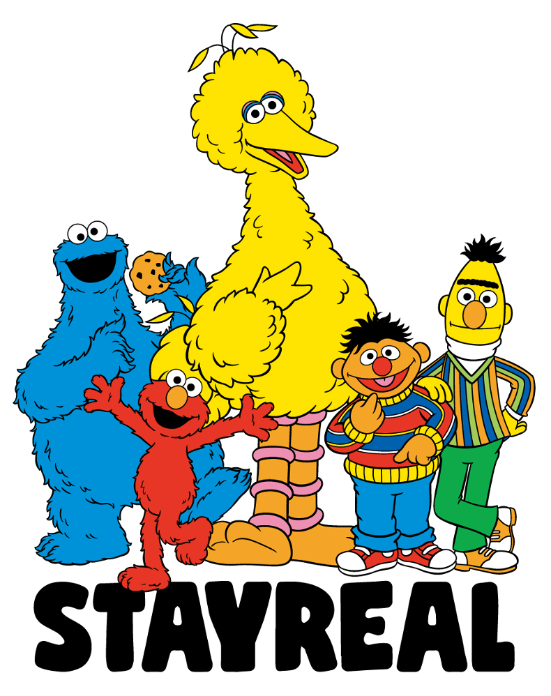

# DistilBert 

## 1. Background

### 1.1. BERT model

<div align=center></div>

BERT (Bidirectional Encoder Representations from Transformers) 

#### 1.1.1. train task

* Only predict the masked words rather than reconstructing the entire input 
* Masked Language Model (MLM)  and next sentence prediction 

#### 1.1.2. Architecture

<div align=center></div>

* BERT’s model architecture is a multi-layer bidirectional Transformer encoder
* Layer number (Transformer blocks): `L` (Base 12, Large 24)
* Hidden size: `H` (Base 768, Large 1024)
* Number of self-attention heads: `A `(Base 12, Large 16)

#### 1.1.3. Input Representation

* Use WordPiece embeddings  (Wu, 2016)， 30,000 token
* Two methods of processing sentence pairs into one sentence: separated by the special token `[SEP]`; and by a new Embedding Mark which sentence each token belongs to
* Sentence pairs are packed together into a single sequence. We differentiate the sentences in two ways.
* The input embeddings are the sum of `token embeddings`, `segmentation embeddings`, and `position embeddings`.

#### 1.1.4. Mask Mechanism

* A downside is that they are creating a mismatch between pre-training and fine-tuning since the `MASK]` oken does not appear during fine-tuning. 
* To mitigate this, they do not always replace “masked” words with the actual `[MASK]` oken. The training data generator chooses 15% of the token positions at random for prediction. If the i-th token is chosen, we replace the i-th token with 

  * the `[MASK]` token 80% of the time 
  * a random token 10% of the time 
  * the unchanged i-th token 10% of the time. 

#### 1.1.5. NSP
* When choosing the sentences A and B for each pre-training example, 
	* 50% part of  B is the actual next sentence that follows A  => (labeled as `IsNext`), 
	* 50% part is a random sentence from the corpus  => (labeled as `NotNext`). 

#### 1.1.6 Output

* Then, Ti (output of hidden layer) will be used to predict the original token with cross entropy loss.

* The final hidden state corresponding to this token is used as the aggregate sequence representation for classification tasks. 

```
Input = [CLS] the man went to [MASK] store [SEP] he bought a gallon [MASK] milk [SEP]
Label = IsNext
Input = [CLS] the man [MASK] to the store [SEP] penguin [MASK] are flight ##less birds [SEP]
Label = NotNext
```

#### 1.1.7 Fine-tune 

* The more classic tasks, including text classification, QA, and NER, can be done through a unified framework. By pretraining a unified large model, it can be used for various downstream tasks.

* Bert and its extensions achieve exciting performance(SOTA)
	* Text Classification
	* Question answering, Machine Reading Comprehension
	* Named Entity Recognition
	* Machine translation

#### 1.1.8 Parameter Numbers

* BERT-Base => 110M
* BERT-Large => 340M


### 1.2 Distillation

#### 1.2.1 Introduction

* Hinton et al.(2015) first proposed the concept of knowledge distillation in the article "Distilling the Knowledge in a Neural Network". 
* The core idea is to first train a complex network model, and then use the output of this complex network and the real label of the data to train a more Small network
* The knowledge distillation framework usually contains a complex model (called the Teacher model) and a small model (called the Student model).

<div align=center></div>


#### 1.2.2 Why use distillation
* Improve the accuracy of the model Imporve the Accuracy of the model
* Reduce model delay and compress network parameters
* Domain transfer between labels


#### 1.2.3 Different methods of Model compress

Model compression can be roughly divided into 5 types:

* **Network Pruning** 
	* weight pruning (Hard to implement, hard to speed up)
	* Neuron pruning
* **Knowledge Distillation** 
  * Provide a small network without too much loss on accuracy comparing with original network

* **Parameter Quantization** 
  * Using less bits to represent a value 
  * Weight clustering
  * Represent frequent clusters by less bits, represent rare clusters by more bits	
<div align=center></div>


* **Parameter matrix approximation**
	* The purpose of reducing matrix parameters is achieved by low-rank decomposition of the matrix or other methods
<div align=center></div>

* **Weight sharing**
	* By sharing parameters, the network parameters can be reduced,
	* For example, Albert shares the transformer layer;

#### 1.2.4 Distillation in NLP 

* While large-scale pre-trained language models lead to significant improvement, they often have several hundred million parameters.
* The problem is the growing computational and memory requirements of these models may hamper wide adoption.
* Fortunately, it is possible to reach similar performances on many downstream-tasks using much smaller language models pre-trained with knowledge distillation, resulting in models that are lighter and faster at inference time, while also requiring a smaller computational training budget.

### 1.3 Distilled models 

* DistilBert
* MobileBert
* TinyBert
* Distilled BiLSTM

#### 1.3.1 Distilled BiLSTM

* Distilling Task-Specific Knowledge from BERT into Simple Neural Networks: https://arxiv.org/abs/1903.12136

<div align=center></div>


* The author proposed to distill knowledge from BERT into a single-layer BiLSTM. Across multiple datasets in paraphrasing, natural language inference, and sentiment classification, model achieve comparable results with ELMo, while using roughly 100 times fewer parameters and 15 times less inference time.

* For BERT, they use the large variant BERTLARGE (described below) as the teacher network, starting with the pretrained weights and following the original, task-specific fine-tuning procedure (Devlin et al., 2018)

##### 1.3.1.1 Data Augmentation for Distillation

The author proposed a novel, rule-based textual data augmentation approach for constructing the knowledge transfer set.

* **Masking.**  
	
	With probability $p_{mask} $ , they randomly replace a word with `[MASK]`  
e.g. `"I loved the comedy"`  => `"I [MASK] the comedy`
	
* **POS-guided word replacement.**  
  With probability $p_{cos}$, they replace a word with another of the same `POS` tag.  
  e.g. `"What do pigs eat?"` => `"How do pigs eat?"`

* **n-gram sampling.**  
  With probability $ P_{ng} $, they randomly sample an n-gram from the example, where n is randomly selected from {1, 2, . . . , 5}. Then mask them together.

* Fix  $P_{mask} = P_{pos} = 0.1$ and $P_{ng} = 0.25$ across all datasets.


#### 1.3.2 BERT-PKD 

* Patient Knowledge Distillation for BERT Model Compression: https://arxiv.org/abs/1908.09355

<div align=center></div>

* Loss:

<div align=center></div>
<div align=center></div>
<div align=center></div>

* The additional training loss introduced by the patient teacher is defined as the mean-square loss between the normalized hidden states:

<div align=center></div>

* Different from previous studies, BERT-PKD proposes Patient Knowledge Distillation, which extracts knowledge from the middle layer of the teacher model to avoid the phenomenon of overfitting when distilling the last layer.

* One hypothesis is that overfitting during knowledge distillation may lead to poor generalization. To mitigate this issue, instead of forcing the student to learn only from the logits of the last layer, authors propose a "patient" teacher-student mechanism to distill knowledge from the teacher's inter-mediate layers as well.

* For the distillation of the intermediate layer, the author uses the normalized MSE, called PT loss.

* The teacher model adopts a fine-tuned `BERT-base`, and the student model has a 6-layer and a 3-layer.

* In order to initialize a better student model, the author proposes two strategies, 
	* One is PKD-skip, which uses the `[2, 4, 6, 8, 10]` layers of `BERT-base`, 
	* The other is PKD-last , using layers `[7, 8, 9, 10, 11]` layers of `BERT-base` (slightly better (<0.01)). 

***

## 2. DistilBert Model

<div align=center></div>


* Developed by *Victor SANH, Lysandre DEBUT, Julien CHAUMOND, Thomas WOLF,* from HuggingFace, [**DistilBERT, a distilled version of BERT: smaller, faster, cheaper and lighter**](https://arxiv.org/pdf/1910.01108.pdf). 
* Due to the large size of BERT, it is difficult for it to put it into production. Suppose we want to use these models on mobile phones, so we require a less weight yet efficient model, that’s when DistilBERT comes into the picture. 
* Distil-BERT has 97% of BERT’s performance while being trained on half of the parameters of BERT. 


### 2.1 Model Structure
#### 2.1.1 MLM mechanism of DistilBert 
##### 2.1.1.1 Static mask

* When inputting, randomly cover or replace any word or word in a sentence, and then let the model predict which part is covered or replaced through contextual understanding, and then only calculate the tokens of the covered part when doing prediction.

* Randomly replace 15% of the tokens in a sentence with the following:
	* These tokens have an 80% chance of being replaced with [Mask];
	* There is a 10% chance of being replaced by any other;
	* There is a 10% chance of being left intact.

```python
# REAL_TOKENS: The real tokens 
_token_ids_real = token_ids[pred_mask]
# RANDOM_TOKENS: select n_tgt ids from vocab_size
_token_ids_rand = _token_ids_real.clone().random_(self.vocab_size)
# MASK_TOKENS: n_tgt number of mask id as [MASK]
_token_ids_mask = _token_ids_real.clone().fill_(
    self.params.special_tok_ids["mask_token"])

# pred_probs = torch.FloatTensor([0.8, 0.1, 0.1])
# Random select with the prob as pred_probs
probs = torch.multinomial(self.pred_probs, len(_token_ids_real), replacement=True)

# process the MASK Tokens with the prob of 80%，10%，10% 
# The final prob is: mask 15%*80%，real 15%*10%，random 15%*10%
_token_ids = (
    _token_ids_mask * (probs == 0).long()
    + _token_ids_real * (probs == 1).long()
    + _token_ids_rand * (probs == 2).long()
)
# using _token_ids take the place of original token ids
# (batch_size, seq_length)
token_ids = token_ids.masked_scatter(pred_mask, _token_ids)
```

##### 2.1.1.2 More attention to low-frequency words

Token_probs is used in the mask to make the selection of mask pay more attention to low-frequency words, so as to achieve smooth sampling of the mask (if sampling is evenly distributed, most of the masks obtained may be repeated high-frequency words).

```python
bs, max_seq_len = token_ids.size()
# copy token_ids
mlm_labels = token_ids.new(token_ids.size()).copy_(token_ids)

# The prob of each tokens 
x_prob = self.token_probs[token_ids.flatten()]

# mlm_mask_prop = 0.15, the prob of mask words is 15%
n_tgt = math.ceil(self.mlm_mask_prop * lengths.sum().item())

# Sample n_tgt words，with the prob of each token as x_prob, without replacement, return the ids of samples
tgt_ids = torch.multinomial(x_prob / x_prob.sum(), n_tgt, replacement=False)
```

#### 2.1.2 DistilBert Model Stcture

* On the basis of the 12-layer Transformer-encoder, one layer is removed from every two layers, and finally, the 12 layers are reduced to 6 layers.
* Removed the token type embedding and pooler.
* Use the soft target of the teacher model and the hidden layer parameters of the teacher model to train the student model.

<div align=center></div>


##### 2.1.2.1 Total Model of the DistilBertModel
```
(distilbert): DistilBertModel(
  
  (embeddings): Embeddings(
    (word_embeddings): Embedding(30522, 768, padding_idx=0)
    (position_embeddings): Embedding(512, 768)
    (LayerNorm): LayerNorm((768,)
    (dropout): Dropout(p=0.1, inplace=False)
  )

  (transformer): Transformer(
    (layer): ModuleList(
      (0): TransformerBlock(
        (attention): MultiHeadSelfAttention()
        (sa_layer_norm): LayerNorm((768,)
        (ffn): FFN( (dropout) (lin1) (lin2) )
        (output_layer_norm): LayerNorm((768,)
      )
      (1): TransformerBlock()
      (2): TransformerBlock()
      (3): TransformerBlock()
      (4): TransformerBlock()
      (5): TransformerBlock()     
    )
  )
)
```

##### 2.1.2.2 Detail Model Part of the Transformer part

```
(transformer): Transformer(
  (layer): ModuleList(
    (0): TransformerBlock(
      (attention): MultiHeadSelfAttention(
        (dropout): Dropout(p=0.1, inplace=False)
        (q_lin): Linear(in=768, out=768, bias=True)
        (k_lin): Linear(in=768, out=768, bias=True)
        (v_lin): Linear(in=768, out=768, bias=True)
        (out_lin): Linear(in=768, out=768, bias=True)
      )
      (sa_layer_norm): LayerNorm((768,)
      (ffn): FFN(
        (dropout): Dropout(p=0.1, inplace=False)
        (lin1): Linear(in=768, out=3072, bias=True)
        (lin2): Linear(in=3072, out=768, bias=True)
      )
      (output_layer_norm): LayerNorm((768,)
    )
        """  Repeat TransformerBlock 6 times   """
  )
)
```

### 2.2 Distiller

#### 2.2.1 Adjustment of the activate function
##### 2.2.1.1 Traditional softmax

* The neural network uses the softmax layer to convert logits to probabilities. The original softmax function:

$$ p_i = \frac{exp(z_i)}{\sum_{j}exp(z_j) } $$

<div align=center></div>

* But directly using the output value of the softmax layer as the soft target, this will bring another problem:

* When the entropy of the probability distribution output by softmax is relatively small, the value of the negative label is very close to 0, and the contribution to the loss function is very small, so small that it can be ignored. So the variable "temperature" comes in handy.

##### 2.2.1.2 Softmax-Temperature:

* The following formula is the softmax function after adding the temperature variable:

$$p_i = \frac{exp(z_i/T)}{\sum_{j}exp(z_j/T) } $$

<div align=center></div>

* Where qi is the probability of each category output, zi is the logits output of each category, and T is the temperature. When the temperature T = 1, this is the standard Softmax formula. 

* The higher the T, the smoother the output probability distribution of softmax, and the larger the entropy of the distribution, the information carried by the negative label will be relatively amplified, and the model training will pay more attention to the negative label.

#### 2.2.2 Loss 

The final loss function is a linear combination of Lce and masked language modeling loss Lmlm. In addition, the author found that adding cosine embedding loss (Lcos) is beneficial to make the direction of the hidden state vector of students and teachers consistent.

* Lce：The loss of the logits of the teacher model and the student model. Using T as the temperature adjustment in the softmax. Using Kullback-Leibler divergence as the loss function $ L_{ce} = \sum_{i}t_i * log(s_i) \quad $ 
	* t_i and s_i means the logits of the teacher model and student model
* Lmlm：the loss of the BERT-MLM task. Using cross-entropy loss function
* Lcos：the loss of the output vector of the teacher's model and the student model. Using cosine loss.

##### 2.2.2.1 Loss_ce

```python
# logits hidden_states(student&teacher) (batch_size, seq_lenth, vocab_size)
s_logits, s_hidden_states = student(input_ids=input_ids, attention_mask=attention_mask)
t_logits, t_hidden_states = teacher(input_ids=input_ids, attention_mask=attention_mask)

# choose masked logits (n_tgt, vocab_size)
s_logits_slct = torch.masked_select(s_logits, mask)
s_logits_slct = s_logits_slct.view(-1, s_logits.size(-1))
t_logits_slct = torch.masked_select(t_logits, mask)
t_logits_slct = t_logits_slct.view(-1, s_logits.size(-1))

# temperature = 2.0，
# ce_loss_fct = nn.KLDivLoss(reduction="batchmean")
# define the loss fucntion as the KL diversity loss
loss_ce = self.ce_loss_fct(
    F.log_softmax(s_logits_slct / self.temperature, dim=-1),
    F.softmax(t_logits_slct / self.temperature, dim=-1)) * (self.temperature) ** 2
```

##### 2.2.2.2 Loss_mlm
```python
# lm_loss_fct = nn.CrossEntropyLoss(ignore_index=-100)
# (batch_size*seq_length, vocab_size), (batch_size*seq_length, )
loss_mlm = self.lm_loss_fct(s_logits.view(-1, s_logits.size(-1)), lm_labels.view(-1))
```

#### 2.2.2.3 Loss_cos
```python
# hidden_state of the last layer, (batch_size, seq_length, dim)
s_hidden_states = s_hidden_states[-1]  
t_hidden_states = t_hidden_states[-1]

# attention_mask: (batch_size, seq_length), mask: (batch_size, seq_length, dim)
mask = attention_mask.unsqueeze(-1).expand_as(s_hidden_states)
dim = s_hidden_states.size(-1)

# (sum(lengths), dim) Change the shape of the data into 2 dimensions
s_hidden_states_slct = torch.masked_select(s_hidden_states, mask)
s_hidden_states_slct = s_hidden_states_slct.view(-1, dim)
t_hidden_states_slct = torch.masked_select(t_hidden_states, mask)
t_hidden_states_slct = t_hidden_states_slct.view(-1, dim)       

target = s_hidden_states_slct.new(s_hidden_states_slct.size(0)).fill_(1)

# cosine_loss_fct = nn.CosineEmbeddingLoss(reduction="mean")
loss_cos = self.cosine_loss_fct(s_hidden_states_slct, t_hidden_states_slct, target)
```
#### 2.2.2.3 Total_Loss

```python
# alpha_ce = 5.0
# alpha_mlm = 2.0 
# alpha_cos = 1.0 
# alpha_clm = 0.0
# alpha_mse = 0.0

loss = alpha_ce * loss_ce +
       alpha_mlm * loss_mlm +
       alpha_cos * loss_cos
```

### 2.3 Conclusion

The model can be understood perceptually. The first and third loss are guaranteed to be the same as the teacher model, and the second loss is the guarantee of self (Bert), which is very explanatory.

* Practice has proved that the universal language model can be successfully trained through distillation.
* Use the knowledge of the teacher model to initialize the student model.
* The use of the cosine loss function can have a better performance effect.


***


## Experiment Process

### 3.1 General Language Understanding

* Language Comprehension and Generalization Assessment
* DistilBERT has 40% fewer parameters than BERT and is 60% faster than BERT.
* The results are compared to the ELMo effect on the Evaluating General Language Understanding (GLUE) benchmark (9 datasets):
* Table 1 shows that in these 9 tasks, DistilBERT is consistently at par or better than ELMo (STS-B is 19 points more accurate).
* Conclusion: DistilBERT retains 97% of its performance with 60% of the parameters compared to BERT.

<div align=center></div>

#### 3.1.1 Downstream tasks

* Downstream task effect evaluation
* We further investigate the performance of DistilBERT on classification tasks (IMDb sentiment classification and question answering task SQuAD).
* As shown in Table 2, DistilBERT only lags BERT by 0.6% (40% fewer parameters) in terms of test accuracy of IMDb. On SQuAD, DistilBERT is within 3.9 points of the full BERT.

<div align=center></div>

* We also investigate whether DistilBERT on SQuAD can be fine-tuned by using the BERT model: teacher loses an extra semester (knowledge distillation). In this case, there are two consecutive distillation steps, one in the pre-training stage and one in the adaptation stage. In this case, the model performance is improved, and the loss accuracy is within 3 points compared to the benchmark (bert).

* Add another step of distillation during the adaptation phase by fine-tuning DistilBERT on SQuAD using a BERT model previously fine-tuned on SQuAD as a teacher for an additional term in the loss (knowledge distillation). 

* In this setting, there are thus two successive steps of distillation, one during the pre-training phase and one during the adaptation phase. 
In this case, an interesting performances given: 79.8 F1 and 70.4 EM, within 3 points of the full model.

#### 3.1.2  Size and inference speed

* To further investigate the speed-up/size trade-off of DistilBERT, the author compared (in Table 3) the number of parameters of each model along with the inference time needed to do a full pass on the STS- B development set on CPU (Intel Xeon E5-2690 v3 Haswell @2.9GHz) using a batch size of 1. DistilBERT has 40% fewer parameters than BERT and is 60% faster than BERT.

#### 3.1.3 On device computation
* On device computation, We studied whether DistilBERT could be used for on-the-edge applications by building a mobile application for question answering. We compare the average inference time on a recent smartphone (iPhone 7 Plus) against our previously trained question answering model based on BERT-base. Excluding the tokenization step, DistilBERT is 71% faster than BERT, and the whole model weighs 207 MB (which could be further reduced with quantization).

### 3.2 Ablation study

* Investigate the influence of various components of the triple loss and the student initialization on the performances（the macro-score on GLUE）of the distilled model. 
  Table 4 presents the deltas with the full triple loss: removing the Masked Language Modeling loss has little impact while the two distillation losses account for a large portion of the performance.

<div align=center></div>

### 3.3 Experiment Proceduer

```python
student_config_class, student_model_class = DistilBertConfig, DistilBertForMaskedLM
teacher_config_class, teacher_model_class, teacher_tokenizer_class = \
BertConfig, BertForMaskedLM, BertTokenizer
 
# Tokenizer
tokenizer = BertTokenizer.from_pretrained("bert-base-uncased")
 
# mlm_smoothing = 0.7, Smoothing parameter to emphasize more rare tokens
token_probs = np.maximum(counts, 1) ** -mlm_smoothing 
for idx in special_tok_ids.values():
    token_probs[idx] = 0.0  # do not predict special tokens
token_probs = torch.from_numpy(token_probs)
"""
special_tok_ids = 
{'unk_token': 100,
 'sep_token': 102,
 'pad_token': 0,
 'cls_token': 101,
 'mask_token': 103}
"""
train_lm_seq_dataset = LmSeqsDataset(params=args, data=data)
 
# Student
stu_architecture_config = DistilBertConfig.from_pretrained("distilbert-base-uncased.json")
stu_architecture_config.output_hidden_states = True
student = DistilBertForMaskedLM(stu_architecture_config)
 
# Teacher
teacher = BertForMaskedLM.from_pretrained("bert-base-uncase", output_hidden_states=True)
 
# Train
distiller = Distiller(
    params=args, dataset=train_lm_seq_dataset, token_probs=token_prob, student=student, teacher=teacher)
```


#### 3.3.1 Loading the dataset

The dataset we will use in this example is SST2, which contains sentences from movie reviews, each labeled as either positive (has the value 1) or negative (has the value 0): 

The dataset is [available](https://github.com/clairett/pytorch-sentiment-classification/) as a file on github, so we just import it directly into a pandas dataframe.(https://github.com/clairett/pytorch-sentiment-classification/raw/master/data/SST2/train.tsv)

| Sentence                                                     | Label |
| :----------------------------------------------------------- | :---: |
| labela stirring , funny and finally transporting re imagining of beauty and the beast and 1930s horror films |   1   |
| apparently reassembled from the cutting room floor of any given daytime soap0they presume their audience won't sit still for a sociology lesson |   0   |
| they presume their audience won't sit still for a sociology lesson |   0   |
| this is a visually stunning rumination on love , memory , history and the war between art and commerce |   1   |
| they presume their audience won't sit still for a sociology lesson |   1   |


#### 3.3.2 Preprocessing the training data

* Before we can feed those texts to our model, we need to preprocess them. 
* This is done by a Transformers `Tokenizer` which will tokenize the inputs (including converting the tokens to their corresponding IDs in the pretrained vocabulary) and put it in a format the model expects, as well as generate the other inputs that model requires.

```python
# Importing pre-trained BERT model and tokenizer
tokenizer = BertTokenizer.from_pretrained("bert-base-uncased")
model = BertModel.from_pretrained("bert-base-uncased")
#Tokenization
tokenized = df[0].apply((lambda x: tokenizer.encode(x, add_special_tokens=True)))
```

* This turns every sentence into the list of ids.

<div align=center></div>

#### 3.3.3 Processing with DistilBERT

* We now create an input tensor out of the padded token matrix, and send that to DistilBERT

```python
input_ids = torch.tensor(np.array(padded))
with torch.no_grad():
    last_hidden_states = model(input_ids)
```

* After running this step, last_hidden_states holds the outputs of DistilBERT.  
* It is a tuple with the shape (number of examples, max number of tokens in the sequence, number of hidden units in the DistilBERT model). In our case, this will be :
	* 2000 (since we only limited ourselves to 2000 examples), 
	* 66 (which is the number of tokens in the longest sequence from the 2000 examples), 
	* 768 (the number of hidden units in the DistilBERT model).

<div align=center></div>

### 3.3 Our Task on Conll03

* https://paperswithcode.com/sota/named-entity-recognition-ner-on-conll-2003

* Parameters
```json
"label2id": {
"B-LOC": 5,
"B-MISC": 7,
"B-ORG": 3,
"B-PER": 1,
"I-LOC": 6,
"I-MISC": 8,
"I-ORG": 4,
"I-PER": 2,
"O": 0
},
"max_position_embeddings": 512,
"model_type": "distilbert",
"n_heads": 12,
"n_layers": 6,
"pad_token_id": 0,
"qa_dropout": 0.1,
"seq_classif_dropout": 0.2,
"sinusoidal_pos_embds": false,
"tie_weights_": true,
"transformers_version": "4.3.1",
"vocab_size": 30522
}
```


* Result Metrics
	
```python
eval_loss = 0.5052699446678162

eval_LOC_precision = 0.9601215343714394
eval_LOC_recall = 0.9656226126814362
eval_LOC_f1 = 0.962864216339745
eval_LOC_number = 2618

eval_MISC_precision = 0.848582995951417
eval_MISC_recall = 0.851340373679935
eval_MISC_f1 = 0.8499594484995945
eval_MISC_number = 1231

eval_ORG_precision = 0.8968140751307656
eval_ORG_recall = 0.9173151750972762
eval_ORG_f1 = 0.9069487857658092
eval_ORG_number = 2056

eval_PER_precision = 0.9727242852448242
eval_PER_recall = 0.975609756097561
eval_PER_f1 = 0.9741648839888103
eval_PER_number = 3034

eval_precision = 0.913160
eval_recall = 0.917552
eval_f1 = 0.915351
eval_accuracy =  0.9838276645431872

epoch = 3.0
```

* Comparing with other model

<div align=center></div>


***


## 4. Further Work
### 4.1 Other Distilled Model
#### 4.1.1 TinyBERT

<div align=center></div>

* TinyBERT proposed a two-stage learning framework. 
* The teacher model was distilled in the pre-training and fine-tuning stages. 
* A 4-layer BERT with a 7.5 times reduction in parameters and a speed increase of 9.4 times was obtained. 
* The effect can reach 96.8% of the teacher model. 

#### 4.1.2 MobileBERT

<div align=center></div>

* The models introduced in the previous article are all hierarchical pruning + distillation operations. 
* MobileBERT is committed to reducing the dimensionality of each layer, reducing the dimensionality of each layer, and reducing the parameters by 4.3 times while retaining 24 layers.

### 4.2 Different Method of Distillation

Three different distillation strategies: 
*  direct distillation of all layers, 
*  the first distillation of the middle layer and then the last layer, 
*  layer-by-layer distillation.

<div align=center></div>

The final conclusion is that the layer-by-layer distillation has the best effect, but the difference is only 0.5 points.

### 4.3 Data Augmentation

Some data augmentation techniques:

#### 4.3.1 Word Replacement

* Data Augmentation using Thesaurus: we randomly pick words and phrases from sentence and replace them with their synonyms.

* Using embeddings：we take the pre-trained embeddings, like Word2Vec, GloVe, FastText, Sent2Vec, to use adjacent embedding to replace word. TinyBert used this technique to improve their language model performance in downstream tasks.

* Generate by Masked Language Model: eg. BERT/RoBerta, use pre-trained model to generate masked sentence and do prediction.

* Using TF-IDF:  replace the word that have relatively low TF-IDF, which will not influence the ground-truth

#### 4.3.2 Back Translation

* Translate to another language and translate back. Using TextBlob or Google Sheets.\

#### 4.3.3 Text pattern transformation

* Do contraction or expansion:

<div align=center></div>

* Resolve ambiguity: allow blur contraction but blur expansion

<div align=center></div>

#### 4.3.4 Add some noise: emhance the robustness of model
* Typo (Randomly)
* Typo (QWERTY Keyboard error)
* Unigram noise: The idea is to replace with words sampled from a single-character frequency distribution. This frequency is basically the number of times each word appears in the training corpus.
* Blank noising: The idea is to replace some random words with placeholder tokens. This article uses "_" as a placeholder tag. In the paper, they use it as a way to avoid context-specific overfitting, as well as a smoothing mechanism for language models. This technology helps improve perplexity and BLEU scores.
* Disorder the sentence
* Cross-over

#### 4.3.5 Voice Change

<div align=center></div>

### 4.4 Tricks of Distillation

We should consider that what do we need to do distillation.

#### 4.4.1 Reduce Layer or Dimension?

* It denpends on pre-training distillation or finer-tune distillation. 
* For pre-trained model distillation, we can refer to MiniLM, MobileBERT or TinyBERT to reduce the layer and dimension. If we want to distill the middle layer without using bottleneck like MobileBERT to re-train a teacher model, we can refer to TinyBERT to do linear transformation on hidden layer loss to expand dimensionality of student model.

#### 4.4.1 Which Loss

* We compared the loss functions used by multiple distillation models. Basically, each model uses a different loss function for distillation. 
* There are multiple combinations of `CE`, `KL`, `MSE`, `Cos`, etc.
* Combing the loss functions used by each distillation model to get the following table:

<div align=center></div>

* For hard labels, using `KL` and `CE` is the same, because $KL(p||q)=H(p||q)-H(p)$, the label distribution is certain when the training set is unchanged. But it is different for soft labels, but many models in the table still use `CE`, only Distilled BiLSTM finds that $MSE(Z^t, Z^s)$ is better. Personally, I think you can try `CE`/`MSE`/`KL`, but `MSE` has the advantage of avoiding the tuning of T parameters.

* For the distillation of the intermediate layer output, most models use `MSE`, and only DistillBERT adds cosine loss to align the direction.

* The distillation loss of the attention matrix is relatively uniform. If you want to distill the attention logits before softmax, you can use `MSE`, and the attention prob after that can use `KL` divergence.


