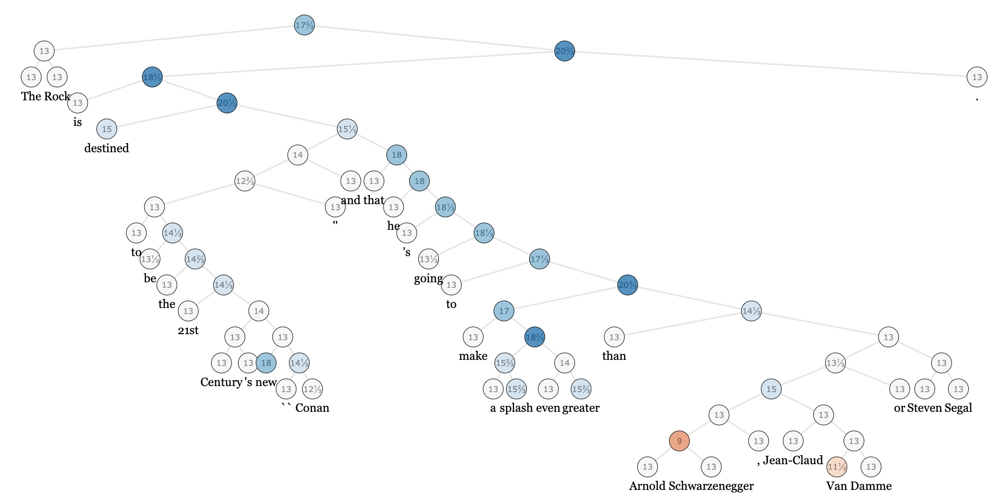
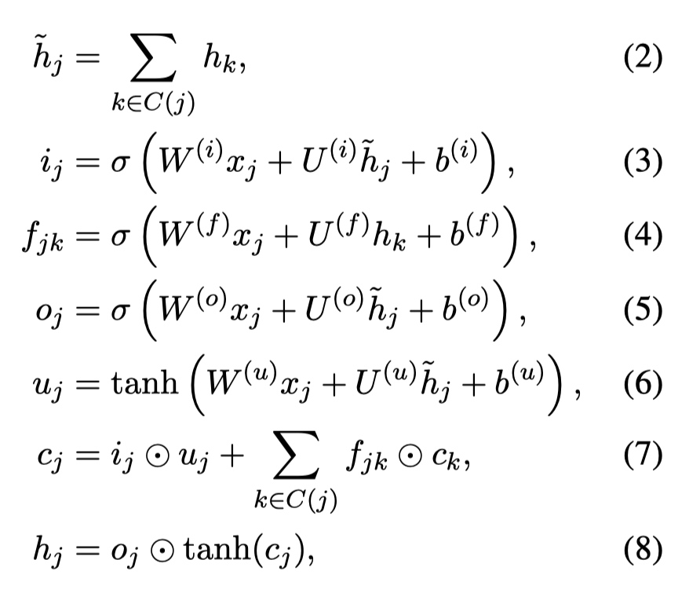
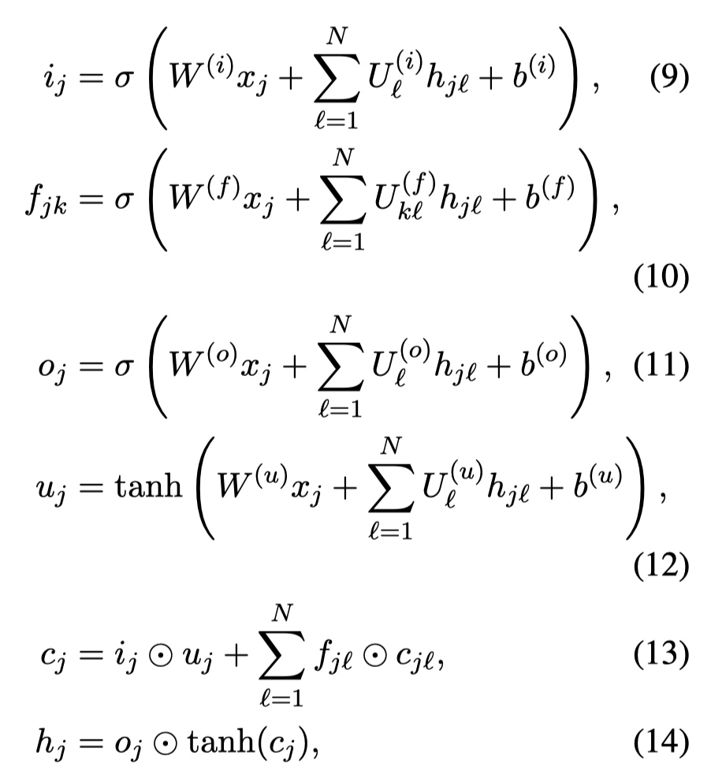
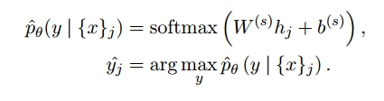
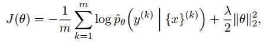
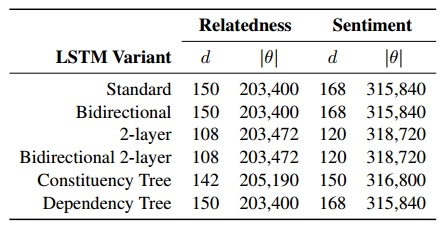
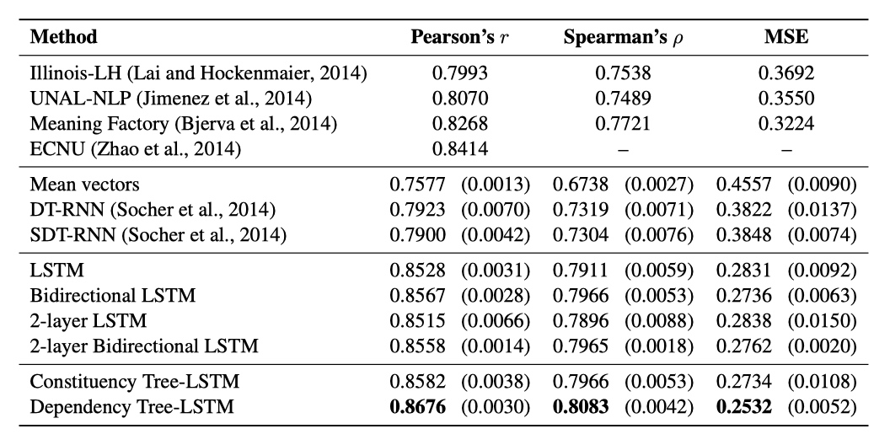

# Sentiment Polarity Prediction of Tree LSTM

## 1. Background and Dataset

### 1.1. Traditional sequential RNN / LSTM

The natural corpus information is sequence structure, we can use the RNN model to extract the information in the corpus. But because different syntactic components contribute differently to semantic information, different syntactic components also have different correlations. Some components with practical meaning, subject, predicate, and object contribute to semantics and complexity, while certain neutral components, such as definite articles and prepositions, contribute less to semantic information. Each cell of the RNN has the same weight.

Each sentence can be combined into a syntactic tree based on the syntactic relationship, allowing the model to learn the structural information in the syntax. We can use Stanford Parser, a syntactic analysis tool from Stanford University, to convert the corpus information of the sequence structure into a syntactic tree. For this, we designed the Tree LSTM model based on the tree-shaped data mechanism to capture the structural data in the text information.

### 1.2. Tree Structural Data Set

Semantic word spaces have been very useful but cannot express the meaning of longer phrases in a principled way. Further progress towards understanding compositionality in tasks such as sentiment detection requires richer supervised training and evaluation resources and more powerful composition models. 

For example, the sentence "The rock is destined to be the 21st Century's new "Conan" and that he is going to make a splash even greater than Arnold Schwarzenegger, Jean-Claud, Van Damme or Steven Segal." can be formulated into such a tree structure

## 2. Models of Tree LSTM

Same as the standard LSTM structure, each cell in the tree LSTM includes similar input gate $i_t$, output gate $o_t$, cell state $c_t$ and hidden layer output $h_t$. The difference is that the update of the gate vector and cell state in the Tree-LSTM unit depends on the state of all related subunits. In addition, compared to the single forgetting gate of Standard LSTM, Tree LSTM has multiple forgetting gates $f_{jk}$, corresponding to each sub-unit $k$ of the current unit allowing Tree-LSTM to selectively obtain information from sub-nodes, for example, to save information of sub-nodes with richer semantic information in sentiment analysis tasks.

Same as the standard LSTM, each Tree-LSTM unit will have an input vector $x_j$. In this article, $x_j$ represents the vectorized representation of the words in a sentence. The input word of each node depends on the tree structure of the network, for example, to process In the Tree-LSTM of the dependency tree, each node in the Tree-LSTM tree takes the vector corresponding to the headword as input; and in the constituency tree, the leaf node takes the corresponding word vector as the input.

There are two kinds of Tree structural LSTM models:
* Child-Sum Tree-LSTMs (Dependency Tree-LSTMs)
* N-ary Tree LSTM (Constituency Tree-LSTMs)

### 2.1. Child-Sum Tree-LSTMs
Given a tree, for node $j$, $C(j)$ represents the set of its child counters, then the formula of Child-Sum Tree-LSTM is as follows:

Here $u_j$ corresponds to the cell state,$\widetilde C_t$ corresponds to the candidate cell state, $C_j$ is the generated cell state in the standard LSTM, which is an element-wise product with the input gate $i_j$.

The biggest difference between the Child-Sum Tree-LSTM and the standard LSTM is:

In the standard LSTM, only the hidden output $h_{t-1}$ of the previous cell is used, but here we need to use  $\hat h_j = \sum_ {k \in C(j)}h_k$, the sum of all the hidden state from its child node. By this method, the tree-LSTM requires multiple forget gates, $f_{jk}=\sigma(W^{(f)}x_j + U^{(f)}h_k + b^{(f)})$.

Since Child-Sum Tree-LSTMs accumulate the state $h_k$ of its child nodes, it is suitable for multi-branch, sub-interrupted disordered trees, such as dependency trees. The number of dependencies of a person is highly variable, so we will apply it in The child and tree-LSTM on the dependency tree is called the dependency tree-LSTM.

### 2.2. N-ary Tree-LSTM
N-ary Tree-LSTM can be used in such tree structures:

The branching factor is at most N
Child nodes are ordered
For any node $j$, the hidden state $h_{jk}$ and cell state of the $k$th child node is $c_{jk}$, then the formula of N-ary Tree-LSTM is as follows:

Obviously, N-ary Tree LSTMs can learn more fine-grained conditional integration of the state of the child nodes. For example, for a node in a constituency tree, the left child node corresponds to a noun phrase (none phrase), and the right child node corresponds to a verb phrase. (verb phrase), assuming more emphasis on verb phrases, the training result of the $U^{(f)}_{kl}$ parameter is to make $f_{jl}$ close to 0 (tend to forget the information of the left child node) and $f_{j2}$ close to 1 (tend to save the right child node) Information).

When applied to the constituency tree, because the constituency tree is a binary tree, the Binary Tree-LSTM unit is used, which we call the Constituency Tree-LSTM. The Constituency Tree-LSTM can be regarded as an N-ary Tree-LSTM where N is 2 Time exception. It should be noted that in Constituency Tree-LSTM, the input vector $j$ will be received if and only if the node $x_j$ is a leaf node.

## 3. Experiment
The Tree-LSTM architecture models were evaluated on two tasks: 
sentiment classification of sentences sampled from movie reviews 

### 3.1. The Task of Tree-LSTM Classification

The target of the first task is to tell the sentiment label, Positive or Negative of the sentence. There are two subtasks: binary classification of sentences, and a more elaborate granularity classification on 5-classes fine-grained: very negative, negative, neutral, positive, and very positive. 

### 3.2.  Baselines
For the baselines models, there are Standard LSTM, Bidirectional LSTM,  2-layer LSTM, and Bidirectional 2-layer LSTM. And we will test the performance of the Tree LSTM model compared with these sequential LSTM models on the tree structural dataset.

### 3.3.  Procedure

At each node j, we use a softmax classifier to predict the label $\hat y_j$ given the inputs $\{x\}_j$ observed at nodes in the subtree rooted at $j$. The classifier takes the hidden state $h_j$ at the node as input:

The cost function is the negative log-likelihood of the true class labels y (k) at each labeled node:

where m is the number of labeled nodes in the training set, the superscript $k$ indicates the $k$th labeled node, and $\lambda$ is an L2 regularization hyperparameter.

### 3.4. Settings of Hyperparameters

For the sentiment classification task, word representations were updated during training with a learning rate of 0.05 and a mini-batch size of 25. The model parameters were regularized with a per mini-batch L2 regularization strength of $10^{−4}$. The dropout rate of 0.5.

## 4. Result

Comparing the result of Tree LSTM with that of sequential LSTM and other RNN-model on this data set, we can find that the result of Tree LSTM appears better. The value of the Pearson’s correlation and the Spearman’s increase by about one percentage point. And the MSE is lower, with means the result of Tree LSTM has better accuracy. This indicates some structural information of the semantics has been learned by the Tree LSTM. 

There are some drawbacks of the Tree LSTM. Training the Tree LSTM model requires a large number of tree structure data. But tree structure corpus data is not as easy to obtain as the common sequence data. We need to train a stable automatic parser to help us build a syntactic tree model from the sequence corpus data. A large amount of manually labeled data is needed to train such a stable automatic parser with better performance. Even so, the parser will still have some tree modes wrong constructed, which will have a negative impact on the effect of the model.

